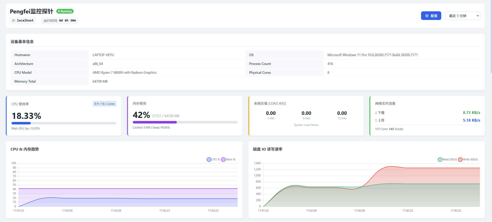
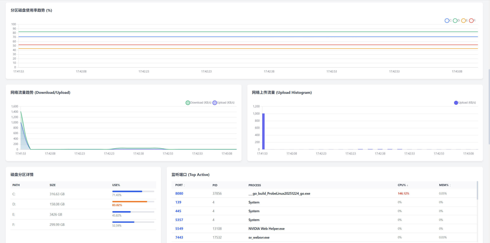
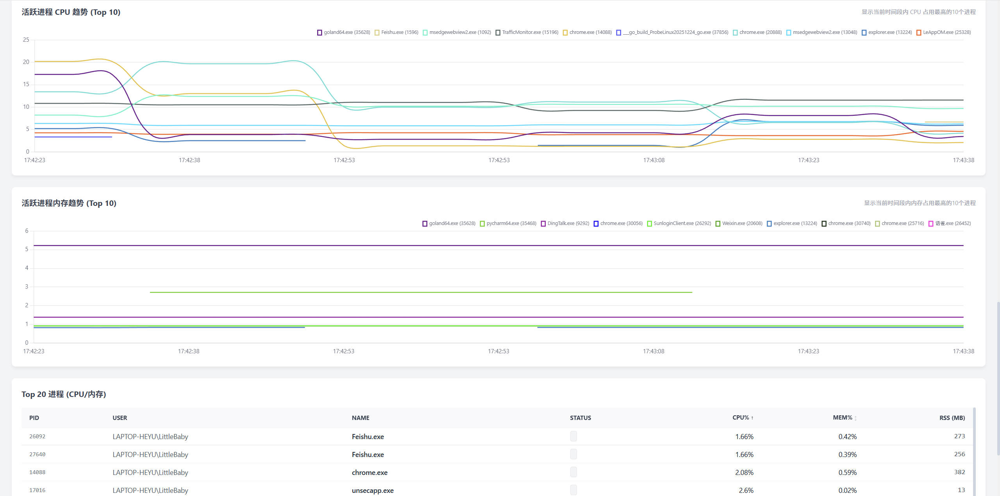

## pengfei-agent 单机
一个轻量级、使用简单、方便监控单台主机设备性能的脚本

> 项目初衷：解决单台Linux主机CPU、内存使用过高时，触发预警信息，便于运维排查问题
## 页面截图
</img>
</img>
</img>
## 报警阈值设置
</img>

## Linux启动打包程序
```bash
chmod 744 agent_linux

nohup ./agent_linux 2>&1 &
```
启动示例
```bash
[RUN] 2025/12/25 17:41:53 提示: 建议在 Linux 环境下以 root 权限运行。
[RUN] 2025/12/25 17:41:53 -------------------------------------------
[RUN] 2025/12/25 17:41:53    Pengfei监控探针 (运行中)
[RUN] 2025/12/25 17:41:53 -------------------------------------------
[RUN] 2025/12/25 17:41:53 1. 数据库路径: monitor.db
[RUN] 2025/12/25 17:41:53 2. 服务端口: 8080
[RUN] 2025/12/25 17:41:53 3. 数据保留: 30 天
[RUN] 2025/12/25 17:41:53 4. 运行日志: run.log
[RUN] 2025/12/25 17:41:53 5. 报警日志: send.log
[RUN] 2025/12/25 17:41:53 6. 访问地址: http://localhost:8080
[RUN] 2025/12/25 17:41:53 -------------------------------------------
[RUN] 2025/12/25 17:41:53 [17:41:53] 数据采集完成 (Top20进程已更新)...
[RUN] 2025/12/25 17:42:08 [17:42:08] 数据采集完成 (Top20进程已更新)...
[RUN] 2025/12/25 17:42:23 [17:42:23] 数据采集完成 (Top20进程已更新)...
```
文件结构
```bash
pengfei/
├── agent_linux
├── config.json
├── monitor.db
├── nohup.out
├── run.log
└── send.log
```

## 配置文件
```json
{
  "app_name": "Pengfei监控探针",
  "retention_days": 30,
  "server_port": 8080,
  "db_path": "monitor.db",
  "run_log_path": "run.log",
  "send_log_path": "send.log",
  "alert": {
    "enable": true,
    "enable_recovery": true,
    "cpu_threshold": 80,
    "mem_threshold": 80,
    "disk_threshold": 85,
    "cooldown_seconds": 300,
    "trigger_template": "【报警】\n主机: {{hostname}}\n时间: {{time}}\n内容: {{type}} 使用率过高: {{value}}% (阈值: {{threshold}}%)",
    "recover_template": "【恢复】\n主机: {{hostname}}\n时间: {{time}}\n内容: {{type}} 已恢复正常: {{value}}% (阈值: {{threshold}}%)"
  },
  "notify": {
    "enable_email": false,
    "email_host": "smtp.qq.com",
    "email_port": 587,
    "email_user": "",
    "email_pass": "",
    "email_to": "",
    "enable_dingtalk": false,
    "dingtalk_token": "",
    "enable_feishu": false,
    "feishu_webhook": ""
  }
}
```
支持配置**邮件、钉钉机器人、飞书机器人**发送报警信息，目前仅支持文本格式。

